# Power ShinyApp

The Power ShinyApp is a web-based interactive application developed using R’s Shiny framework.
The developed app is designed to perform statistical power analysis for Two-Sample/Population Functional Hypothesis Test (Functional/Curve data) using multiple statistical methods.
The application supports multiple data inputs, interactive visualisation, and statistical power computation to provide a flexible tool for simulation-based power analysis. 


---

## Quick Start (TL;DR)

```bash
# 1) Install R and RStudio (see detailed instructions below if you need help)

# 2) Get the code
# Option A: download ZIP from GitHub, then unzip and cd into the folder

# Option B: clone with Git
git clone https://github.com/mr-seydi/PowerShinyApp.git
cd PowerShinyApp

# 3) Open in RStudio and install packages
# In R console:
install.packages(c("shiny"))  # or use renv::restore() if renv.lock exists

# 4) Run the app

## From RStudio

# 1. Double-click `Power_ShinyApp.Rproj` to open the project.
# 2. In the Console, run: shiny::runApp()
# Shiny will automatically find `ui.R` and `server.R` in the project root.

## From Terminal

# Since this app has ui.R and server.R in the project root:
R -e "shiny::runApp('.', host='127.0.0.1', port=3838)"
```

---

## Table of Contents

* [Requirements](#requirements)
* [Install R](#install-r)

  * [Windows](#windows)
  * [macOS](#macos)
  * [Linux](#linux)
* [Install RStudio](#install-rstudio)
* [Get the App Code](#get-the-app-code)
* [Set Up R Packages](#set-up-r-packages)

  * [Use `renv` (recommended)](#use-renv-recommended)
* [Run the App](#run-the-app)

  * [From RStudio](#from-rstudio)
  * [From Terminal](#from-terminal)

* [Introduction to Power ShinyApp](#introduction-to-power-shinyapp)
  * [Dataset Selection](#dataset-selection)
    * [Available Input Types visual placeholders](#available-input-types-visual-placeholders)
      * [Baseline Data](#baseline-data)
      * [Two-Sample Data](#two-sample-data)
      * [Custom Curve](#custom-curve)
      * [Pilot Data](#pilot-data)
    * [Pilot Data Requirements](#pilot-data-requirements)
  * [Parameters and Plots](#parameters-and-plots)
    * [Parameter Panels](#parameter-panels)
      * [Noise Parameters](#noise-parameters)
      * [Signal Parameters shown only for baseline data or custom curves](#signal-parameters-shown-only-for-baseline-data-or-custom-curves)
    * [Plots Section](#plots-section)
    * [Visual examples placeholders](#visual-examples-placeholders)
      * [1. Baseline Data](#1-baseline-data)
      * [2. Two-Sample Data](#2-two-sample-data)
      * [3. Custom Curve](#3-custom-curve)
      * [4. Pilot Data](#4-pilot-data)
  * [Power Calculation](#power-calculation)
  * [Notes & Tips](#notes--tips)


* [Troubleshooting](#troubleshooting)
* [How to Update](#how-to-update)
* [License](#license)

---

## Requirements

* **Operating System:** Windows 10/11, macOS 12+ (Monterey) or newer, or a modern Linux distribution
* **R version:** 4.2 or newer (older *may* work but is not supported)
* **RStudio:** current desktop release
* **Internet:** required on first run for package installation

> Check your R version:
>
> ```r
> R.version.string
> ```

---

## Install R

### Windows

1. Download R from CRAN: [https://cran.r-project.org/bin/windows/base/](https://cran.r-project.org/bin/windows/base/)
2. Run the installer and accept the defaults unless you need a custom location.
3. (Optional, CLI) If you use [Chocolatey](https://chocolatey.org/), open **Admin PowerShell** and run:

   ```powershell
   choco install r.project -y
   ```

### macOS

1. Download the latest R pkg from CRAN: [https://cran.r-project.org/bin/macosx/](https://cran.r-project.org/bin/macosx/)
2. Double-click the `.pkg` and follow the prompts.
3. (Optional, Homebrew):

   ```bash
   brew install --cask r
   ```

### Linux

* **Ubuntu/Debian:**

  ```bash
  sudo apt update
  sudo apt install -y r-base
  ```
* **Fedora/RHEL/CentOS:**

  ```bash
  sudo dnf install -y R
  ```
* **Arch:**

  ```bash
  sudo pacman -S --noconfirm r
  ```

> For system libraries needed by certain R packages (e.g., `libcurl`, `openssl`, `xml2`), see your distro docs.

---

## Install RStudio

* Download RStudio Desktop (Posit) for your OS: [https://posit.co/download/rstudio-desktop/](https://posit.co/download/rstudio-desktop/)
* Run the installer (macOS: drag app to Applications; Windows: follow the setup wizard; Linux: install the `.deb`/`.rpm`).
* Launch **RStudio**.

---

## Get the App Code

### Option A — Clone with Git (recommended)

```bash
git clone https://github.com/mr-seydi/PowerShinyApp.git
cd PowerShinyApp
```

### Option B — Download ZIP

1. Go to `https://github.com/mr-seydi/PowerShinyApp`.
2. Click **Code ▸ Download ZIP**.
3. Unzip and open the folder.

> **Project structure (example):**
>
> ```text
> PowerShinyApp/
> ├─ ui.R
> ├─ server.R
> ├─ Power_ShinyApp.Rproj
> ├─ R/                 # helper functions
> ├─ www/               # static assets (css/js/images)
> ├─ data/              # data files (if any)
> ├─ renv.lock          # pinned package versions (if using renv)
> └─ README.md
> ```

---

## Set Up R Packages

Open the project in **RStudio** (double-click `Power_ShinyApp.Rproj`) or set your working directory to the repo root:

```r
setwd("/path/to/PowerShinyApp")
```

### Use `renv` (recommended)

If the repo includes an `renv.lock` file, run:

```r
install.packages("renv")
renv::restore()  # installs exact package versions from renv.lock
```


---

## Run the App

### From RStudio

1. Double-click `Power_ShinyApp.Rproj` to open the project.
2. In the Console, run:

   ```r
   shiny::runApp()
   ```

   Shiny will automatically find `ui.R` and `server.R` in the project root.

### From Terminal

Run Shiny on a specific host/port:

```bash
R -e "shiny::runApp('.', host='0.0.0.0', port=3838)"
```

Then open: [http://localhost:3838](http://localhost:3838)


## Introduction to Power ShinyApp
Power ShinyApp is your Tool for Statistical Power Analysis for Two-Sample/Population Functional Hypothesis Test.
It provides a user-friendly platform for conducting advanced statistical power analyses of functional (curve) data. Whether you are in academia or industry, it simplifies complex calculations, enabling accurate, valid and efficient study planning, sample size estimation and data interpretation.

---

### Dataset Selection

<!-- Picture 1 -->

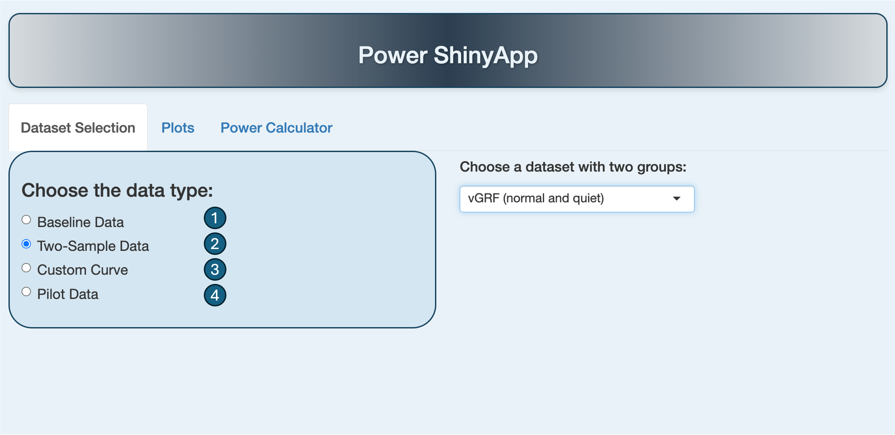

Choose how you want to create or upload mean functions (curves) for your two-group/population comparison:

1. **Baseline + Gaussian signal** — Select a mean function (curve) of one group from six publicly available datasets and add a Gaussian signal to create the other group's mean function.
2. **Two-group dataset** — Select a dataset that represents the mean functions (curves) of two groups from various publicly available biomechanical datasets.
3. **Custom drawing** — Draw custom mean functions (curves) directly on a coordinate plane.
4. **Pilot data upload** — Upload your pilot data to perform power analysis.

---

#### Available Input Types (visual placeholders)

1. **Baseline Data**

<table>
  <tr>
    <td>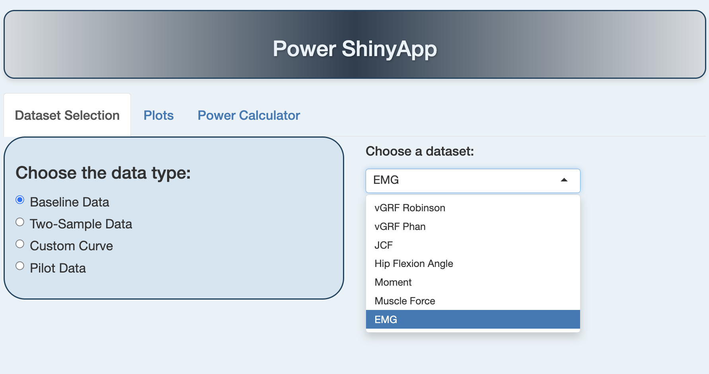</td>
    <td>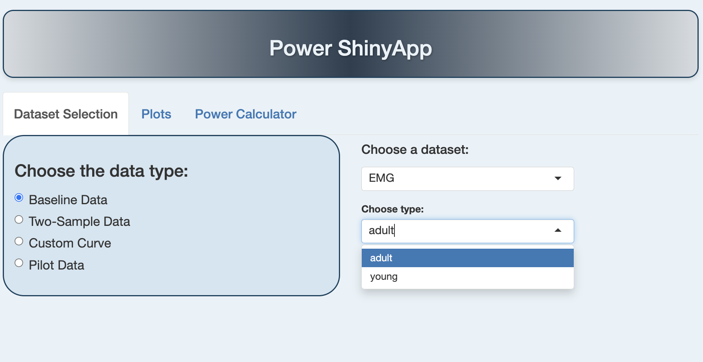</td>
  </tr>
  <tr>
    <td align="center"></td>
    <td align="center"></td>
  </tr>
</table>

2. **Two-Sample Data**

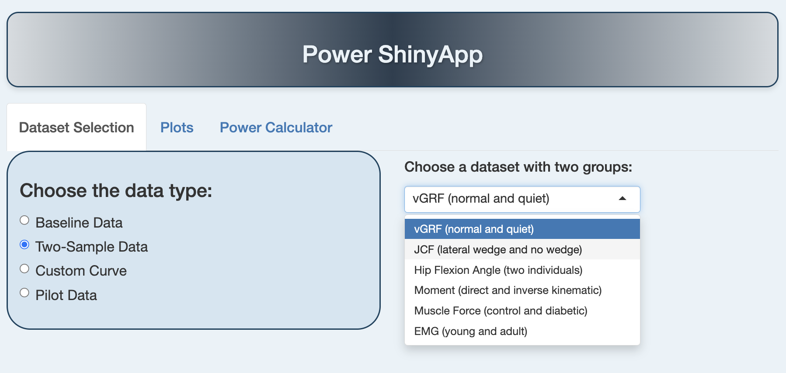

3. **Custom Curve**

<table>
  <tr>
    <td>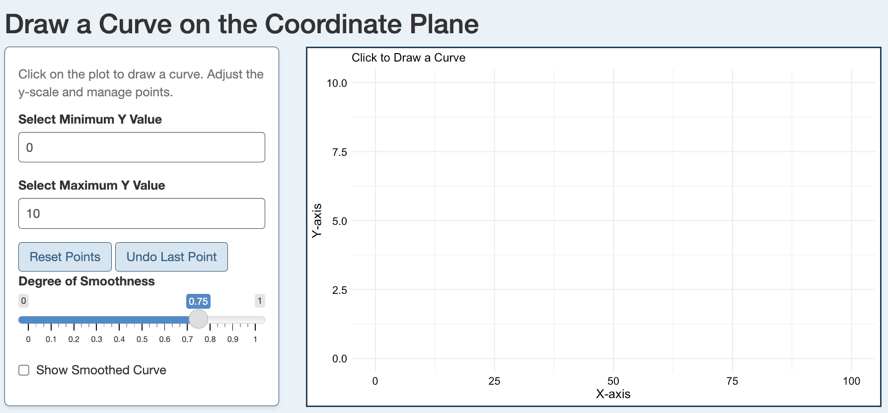</td>
    <td>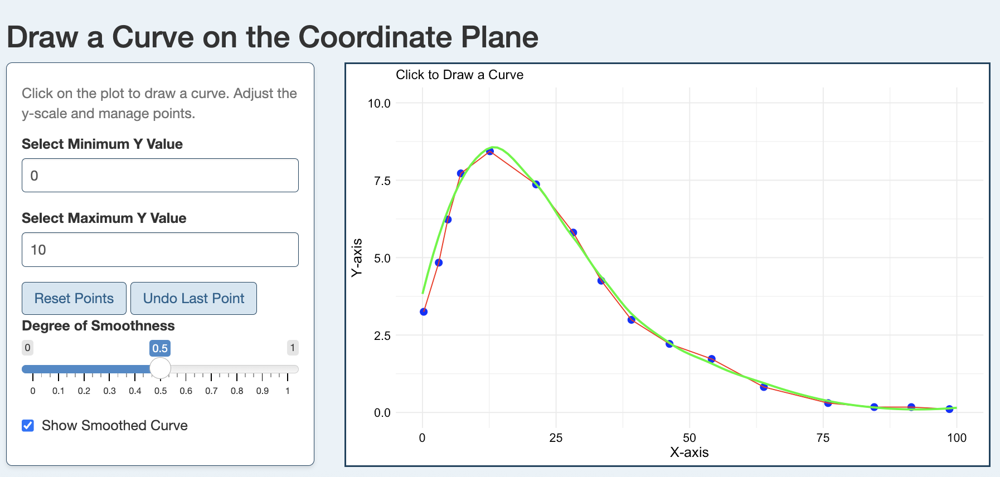</td>
  </tr>
  <tr>
    <td align="center"></td>
    <td align="center"></td>
  </tr>
</table>

4. **Pilot Data**

<!-- Two rows: Pic7 and Pic8 -->

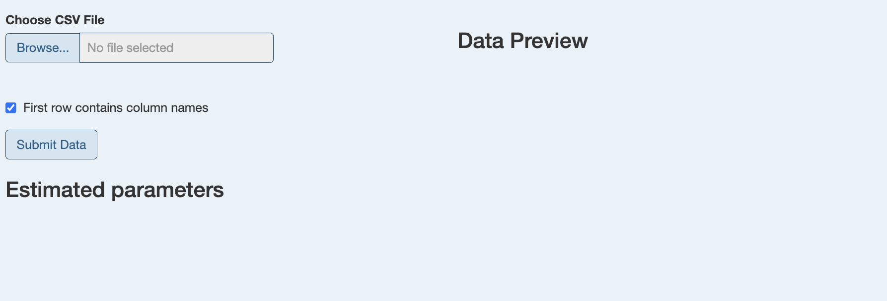

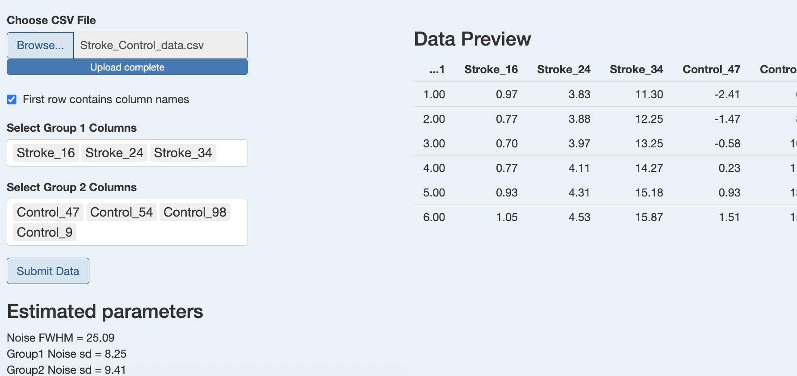

---

#### Pilot Data Requirements

Assume you have preliminary data gathered during a pilot study — a small-scale preliminary study to test the procedures and instruments of a larger, main study. This data helps researchers refine their methodology, estimate necessary sample sizes for the full study, identify potential problems, and assess the feasibility of their research.

**The dataset you upload must have the following structure:**

- **Columns:** Each column should represent an individual curve.
- **Rows:** Each row corresponds to an evaluation point, and there must be exactly **101 observation points** (rows).

After uploading the dataset, you will select two groups of individual curves for analysis. The estimated smoothness (Noise FWHM) and the standard deviation of the noise functions will guide you in choosing the appropriate parameters for the next step.

If your raw data has a different number of evaluation points, you can resample to 101 evaluation points using the following R helper function (requires the `fda` package):

```r
library(fda)

data_to_101evalpoints <- function(data){
  # data: matrix with rows = original time/eval points, columns = functions
  data_to_fd <- Data2fd(argvals = 0:(nrow(data) - 1), y = data)
  rangeval <- data_to_fd$basis$rangeval
  eval.points <- seq(rangeval[1], rangeval[2], length.out = 101)
  final_data <- eval.fd(fdobj = data_to_fd, evalarg = eval.points)
  return(final_data)
}
```

---

### Parameters and Plots

#### Parameter Panels

This section allows you to define the characteristics of both the noise and, if applicable, the signal used in your analysis or simulation. Adjusting these parameters changes how the app generates or interprets your data, giving you full control over the input conditions.

##### Noise Parameters

- **Sample Size:** number of functions (curves) in each group.
- **Mean (μ):** average value of the noise.
- **Standard Deviation (σ):** variability of the noise.
- **Full Width at Half Maximum (FWHM):** controls the smoothness of the noise; higher FWHM means smoother noise.

##### Signal Parameters (shown only for baseline data or custom curves)

- **Center:** location of the main effect or signal peak.
- **Signal FWHM (SFWHM):** width of the signal.
- **Amplitude:** height or strength of the signal.

#### Plots Section

Based on the parameters you choose, the app displays three plots side by side to help you visualize the data and check whether your settings make sense.

- **Noise Plot:** shows one illustration of the simulated noise curve.
- **Signal Plot / Mean functions:** shows the mean functions and the effect (difference between two mean functions) or signal (if using baseline data or custom curves).
- **Data Plot:** shows one illustration of the generated sample functional data.


#### Visual examples (placeholders)

**1. Baseline Data**

<table>
  <tr>
    <td>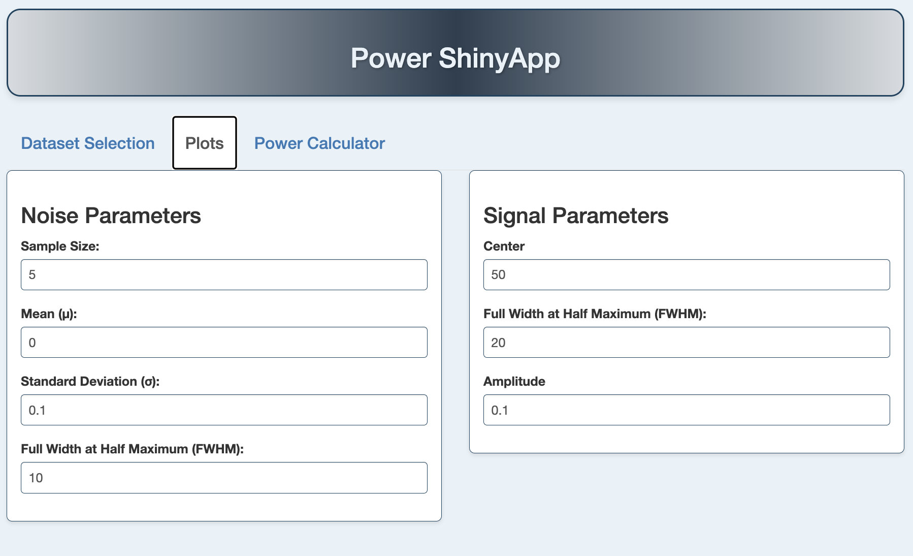</td>
    <td>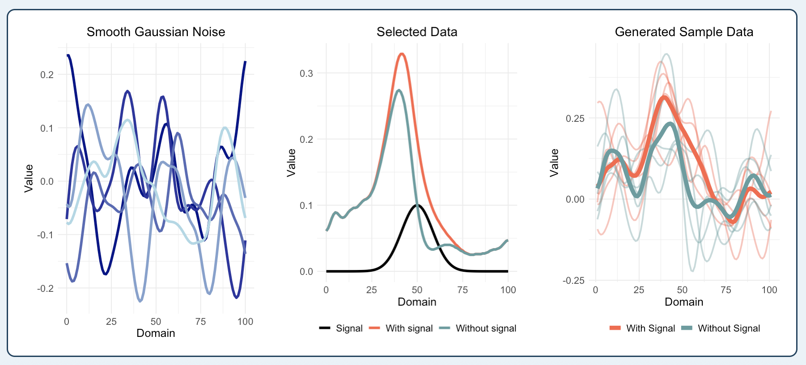</td>
  </tr>
  <tr>
    <td align="center"></td>
    <td align="center"></td>
  </tr>
</table>

**2. Two-Sample Data**

<table>
  <tr>
    <td>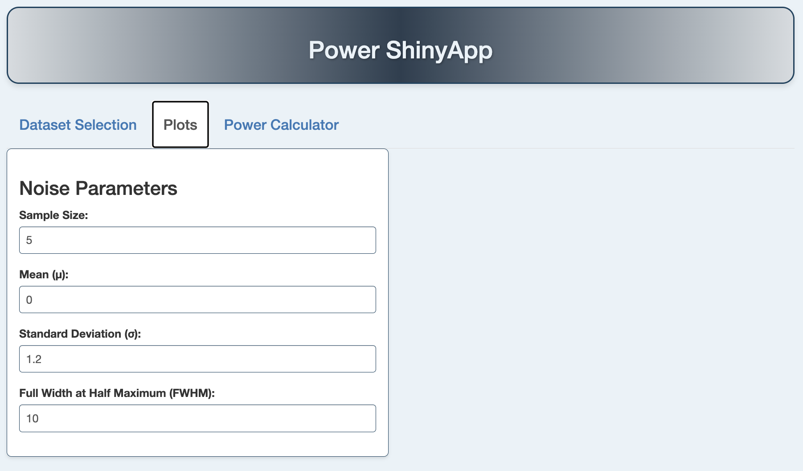</td>
    <td>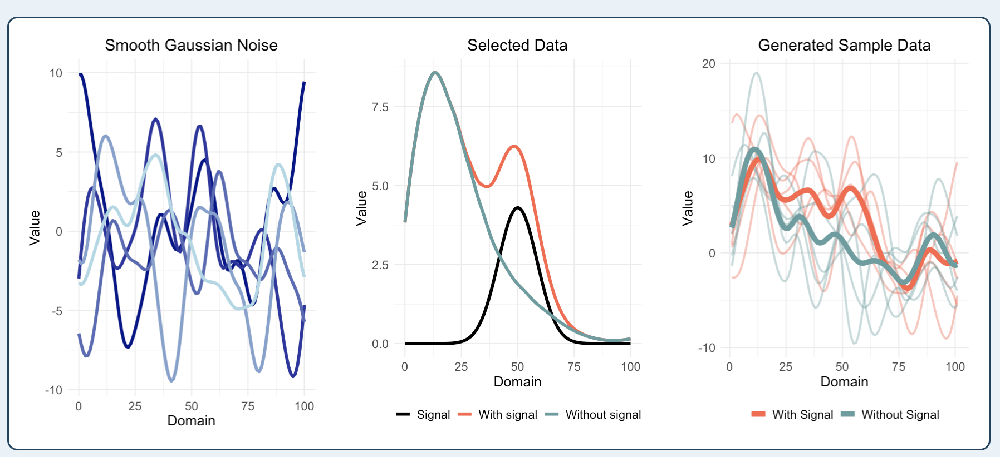</td>
  </tr>
  <tr>
    <td align="center"></td>
    <td align="center"></td>
  </tr>
</table>

**3. Custom Curve**

<table>
  <tr>
    <td>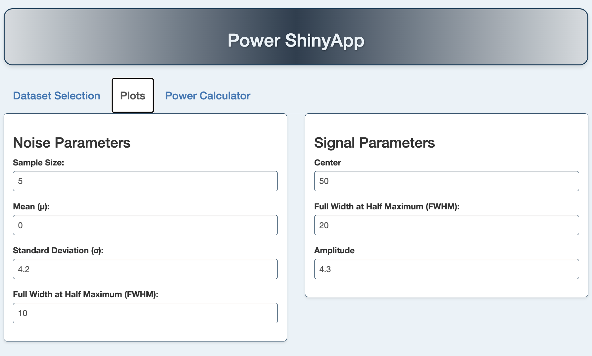</td>
    <td>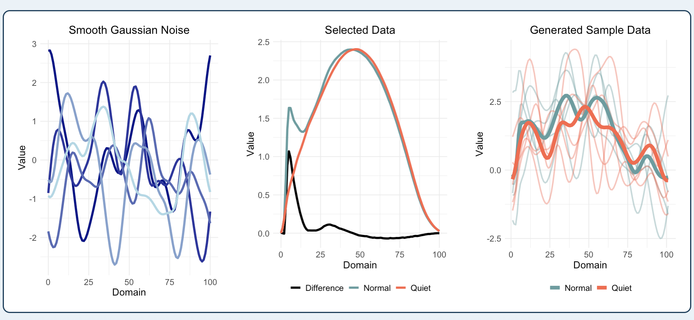</td>
  </tr>
  <tr>
    <td align="center"></td>
    <td align="center"></td>
  </tr>
</table>

**4. Pilot Data**

<table>
  <tr>
    <td>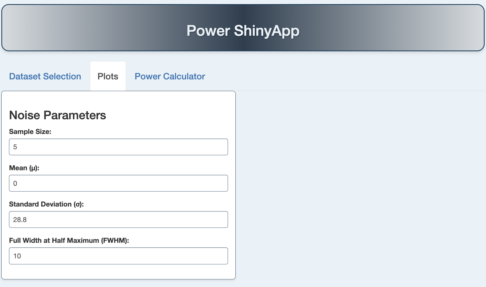</td>
    <td>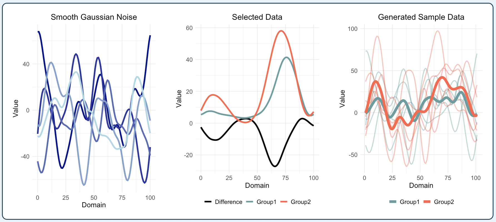</td>
  </tr>
  <tr>
    <td align="center"></td>
    <td align="center"></td>
  </tr>
</table>

---

### Power Calculation

- **Method:** choose one or more statistical tests (IWT, TWT, SPM, F-max, ERL, IATSE). For more information, see the associated papers referred to in the paper.
- **Number of Iterations:** how many simulations to run for estimating power (more iterations give more stable results but take longer).
- **Calculate Power:** starts the power calculation.
- **Stop Calculation:** interrupts long simulations.

The calculated statistical power is shown on the right side of this tab.

<!-- Pic17 -->

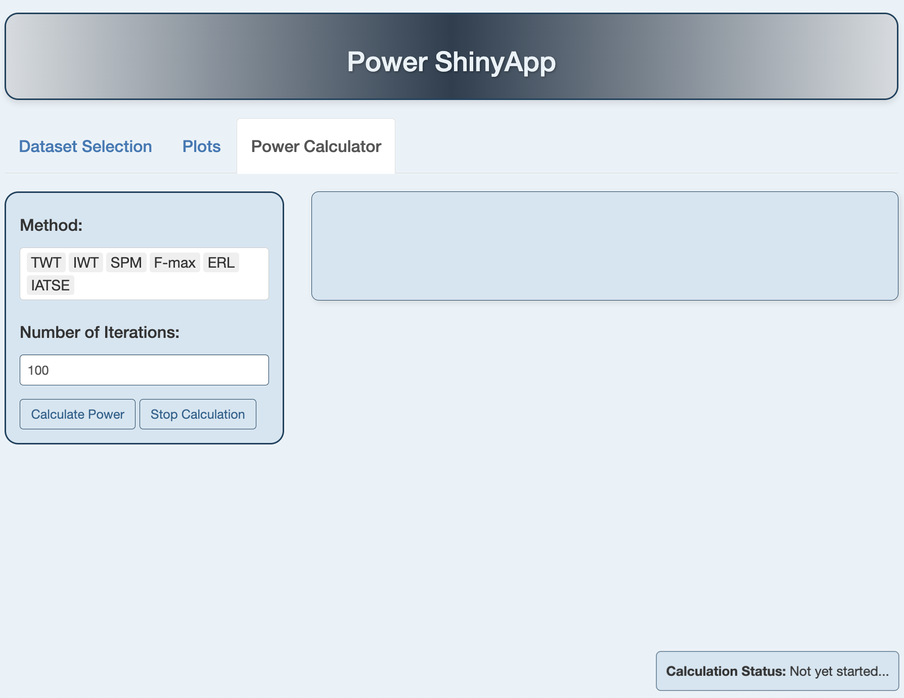

---

### Notes & Tips

- Use pilot data to estimate realistic noise parameters (FWHM and σ) whenever possible, this usually improves the accuracy of sample size recommendations.
- When drawing custom curves, try to match the range and smoothness expected in your real measurements so simulations reflect realistic conditions.
- Save commonly used parameter sets as presets for fast re-use during iterative study planning.
- If you use Power ShinyApp in a publication, please cite the app and the methodology papers linked inside the app.
- For bugs or feature requests, open an issue or contact the developers.

---


## Troubleshooting

* **R not found / wrong version**

  * Confirm in R console: `R.version.string`
  * On macOS, if using Homebrew, ensure `/usr/local/bin` or `/opt/homebrew/bin` precedes older R paths.
* **Packages fail to compile on Windows**

  * Install **Rtools** (matching your R version): [https://cran.r-project.org/bin/windows/Rtools/](https://cran.r-project.org/bin/windows/Rtools/)
* **Packages fail to compile on macOS**

  * Install Xcode Command Line Tools: `xcode-select --install`
* **Linux missing system libs**

  * Install `libcurl`, `openssl`, `libxml2`, `harfbuzz`, `fribidi`, `freetype`, etc., via your package manager.
* **Port already in use**

  * Change port: `shiny::runApp(port = 4242)`
* **App can’t find files**

  * Make sure your working directory is the **project root**. In RStudio: *Session ▸ Set Working Directory ▸ To Project Directory*.
* **White screen / nothing loads**

  * Open the R console for errors; check the browser dev tools (Network/Console). Try `options(shiny.fullstacktrace = TRUE)`.


## How to Update

```bash
cd PowerShinyApp
git pull
# If using renv:
R -e "renv::restore()"
```

---

## License

This project is licensed under the [MIT License](LICENSE) unless otherwise noted.

---

## Citation

If you use this app in academic work, please cite this paper:

Sample Size Estimation for Functional Data Analysis with Web Application

Mohammad Reza Seydi, Johan Strandberg, Todd C. Pataky, and Lina Schelin


---

## Acknowledgments

* Shiny by Posit

---

### Maintainer & Support

* **Maintainer:** Reza Seydi
* **Email:** [mohammad.seydi@umu.se](mailto:mohammad.seydi@umu.se)
* **Issues:** Please open an issue here: `https://github.com/mr-seydi/PowerShinyApp/issues`

